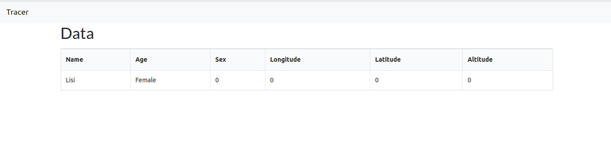

# FR2I competition - Mobile computing (Web)

> Build a platform for oneline/offline data collection through a mobile application and synchronization on a web server.

This is the web application of the platform. As features, it only display real-time data received from the NodeJS server. Follow this [link](https://github.com/maelfosso/fr2i-api) to download the **api**.

## Built With

- ReactJs
- Docker
- Docker compose

## Live Demo

[Live Demo Link](https://maelfosso.github.io/fr2i-web)

## Getting Started

### Prerequisites

`docker-compose` installed. If you don't have it, you must have `NodeJs` and `yarn` installed.

### Setup

- Clone the repository `git clone https://github.com/maelfosso/fr2i-web.git`
- Change the current directory `cd fr2i-web`
- Install the dependencies `yarn install`
- Run the application `yarn dev`
- Open your browser at `http://localhost:3000`

### Usage

Alone, this project can't work. It must be connected to the backend.
Download it [here](https://github.com/maelfosso/fr2i-api) and follow the instruction to install it

## Docker

As indicated up there, it's possible to run it using `docker-compose`.
You will not have to download the source code to run it.
Kindly follow this [link][http://github.com/maelfosso/fr2i-competition] and follow the instruction to deploy the whole platform.

## Authors

👤 **Mael FOSSO**

- GitHub: [@maelfosso](https://github.com/maelfosso)
- Twitter: [@maelfosso](https://twitter.com/maelfosso)
- LinkedIn: [LinkedIn](https://www.linkedin.com/in/mael-fosso-650b6346/)

## 🤝 Contributing

Contributions, issues, and feature requests are welcome!

Feel free to check the [issues page](issues/).

## Show your support

Give a ⭐️ if you like this project!

## 📝 License

This project is [MIT](lic.url) licensed.